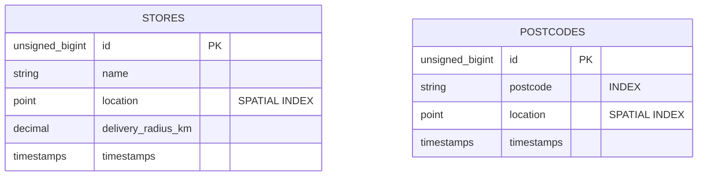

# 📍 Store Management & Delivery API

A high-performance Laravel 12 API for managing retail store locations and calculating delivery feasibility using geospatial coordinates and UK postcodes.

## 🚀 Quick Start

1. **Clone & Environment**:
    ```bash
    cp .env.example .env
    # Ensure DB_CONNECTION=mariadb and that DB_PASSWORD is uncommented and set to something
    ```

2. **Docker Setup (Sail)**:
    *The following commands assume you have a "sail" alias setup. If you do not, replace "sail" with "vendor/bin/sail"*
    ```bash
    sail composer install
    sail artisan key:generate
    ```
3. **Database & API Setup**:
    ```bash
    sail artisan migrate
    sail artisan install:api
    sail artisan db:seed
    ```
    ***Note**: The seeder will output a Reviewer Token. Use this for POST requests.*

4. **Postcode Import**:
    ```bash
    sail artisan import:postcodes
    ```
    **Note**: I have included a sample of postcodes from [Free Map Tools](https://www.freemaptools.com/download-uk-postcode-lat-lng.htm) - only the first 1000 postcodes are in the sample. You can download the full Full UK Postcode Latitude Longitude CSV file to import if you wish to. Simply place the extracted ukpostcodes.csv file into `storage/app` and run the following command:
    ```bash
    sail artisan import:postcodes --path=storage/app/ukpostcodes.csv
    ```

5. Run tests
    ```bash
    sail artisan test
    ```

---

## 🏗 Architecture Reflection

### 1. Geospatial Strategy
Instead of calculating distances in PHP using the Haversine formula (which is mathematically intensive and slow at scale), I utilized **MariaDB/MySQL Spatial Extensions**.
- **Storage**: Stores and Postcodes use the `POINT` data type.
- **Indexing**: A `SPATIAL` index is applied to the `location` column for $O(log n)$ search performance.
- **Calculation**: I used `ST_Distance_Sphere` to ensure high-accuracy distance calculations directly within the database engine.

### 2. Service-Oriented Architecture
I implemented a `StoreService` to decouple business logic from the `StoreController`.
- **Thin Controllers**: Controllers only handle request validation and response formatting.
- **Reusable Logic**: The delivery feasibility logic is encapsulated, allowing it to be reused by future CLI commands or Job workers without duplicating code.

### 3. Performance & Optimization
- **Caching**: UK postcode coordinates are effectively static. I implemented a 24-hour cache on postcode lookups using `Cache::remember` to reduce hits on the 1.7M+ row postcode table.
- **Memory Management**: The postcode importer uses `LazyCollection` to stream the CSV file, ensuring the import can handle millions of rows without hitting memory limits.

### 4. API Security
I utilized Laravel Sanctum to protect the Store Creation endpoint. This demonstrates a production-ready mindset where data-modifying actions are restricted to authenticated users, while lookup endpoints remain public for consumer use.
    
---

## 📊 Database Schema

- **stores** - `id`, `name`, `location (POINT)`, `delivery_radius_km`, `timestamps`.
- **postcodes** - `id`, `postcode (Indexed)`, `location (POINT)`, `timestamps`



---

## 🔐 Authentication Guide

The `POST /api/stores` endpoint is protected via **Laravel Sanctum**. To interact with it, you must provide a Bearer Token.

### 1. Obtain a Token
After running `sail artisan db:seed`, a token will be printed to your terminal. If you missed it, you can generate a new one via Tinker:
```bash
sail artisan tinker --execute="echo App\Models\User::first()->createToken('manual')->plainTextToken"
```

### 2a. Using Postman

1. Open your request in Postman.
2. Click on the **Auth** tab.
3. Select **Bearer Token** from the dropdown.
4. Paste your token into the **Token** field.

### 2b. Using cURL

```bash
curl -X POST http://localhost/api/stores \
     -H "Authorization: Bearer YOUR_TOKEN_HERE" \
     -H "Content-Type: application/json" \
     -H "Accept: application/json" \
     -d '{
           "name": "Test Store",
           "latitude": 51.5074,
           "longitude": -0.1278,
           "delivery_radius_km": 10
         }'
```

---

## 🛣 API Documentation

1. **Create Store**
    `POST /api/stores`
    - **Auth**: Requires bearer token - this is output when running the db seeder.
    - **Payload**:
        ```json
        {
            "name": "London Oxford Street",
            "latitude": 51.5148,
            "longitude": -0.1419,
            "delivery_radius_km": 5
        }
        ```

2. **Find Nearby Stores**
    `GET /api/stores/nearby?postcode=W1B3AG`
    - **Logic**: Returns all stores where the distance to the postcode is less than or equal to the store's unique `delivery_radius_km`.
    - **Ordering**: Results are returned from nearest to furthest.

3. Check Delivery Feasibility
    `GET /api/stores/can-deliver?postcode=W1B3AG&store_id=1`
    - **Response**:
        ```json
        {
            "can_deliver": true,
            "distance_km": 1.24,
            "store_name": "London Oxford Street"
        }
        ```

---

## 🧪 Testing Suite

The project includes a robust test suite (18 tests) covering:
    **Feature Tests**: Ensuring correct API responses and status codes (201, 404, 422).
    **Validation Tests**: Ensuring coordinates and radii are logically sound.
    **Mocking/Caching**: Verifying that the application correctly interacts with the Cache facade to optimize performance.

